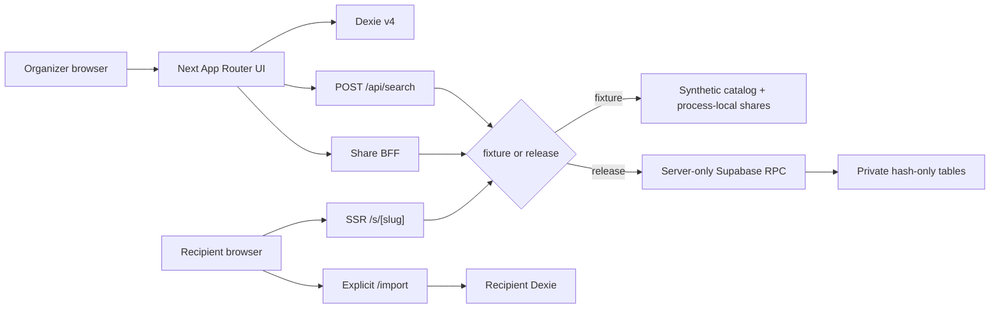

# SingSong Release Architecture

이 문서는 현재 소스 트리의 실행 구조를 설명하는 루트 출시 문서다. 변경 전 자료와 `docs/**`는 의도와 역사 보존을 위해 수정하지 않았으며, 구현 사실이 오래된 문서와 다를 때는 코드·테스트와 이 문서를 함께 확인한다. 제품 우선순위는 여전히 `docs/FINAL_BLUEPRINT.md`와 `docs/prompts/ONESHOT_MASTER.md`가 소유한다.

## 제품과 신뢰 경계

SingSong은 가입 없이 한 브라우저 저장소의 활성 노래방 플랜 하나를 검색·직접 입력하고, 가격표 기준 시간·비용 범위를 계산해 티켓으로 전달하는 local-first PWA다. 계정, 여러 목록, 히스토리, 결제, Discover, 실시간 공동 편집과 스트리밍 playlist import는 P0에 없다.



브라우저는 Supabase credential이나 private table에 직접 접근하지 않는다. 개인 플랜과 발급 티켓의 진실은 IndexedDB이며, 서버는 사용자가 명시적으로 만든 immutable 공유 snapshot만 소유한다.

## 실행 프로필

외부 build 계약은 `fixture`와 `release` 두 프로필이다. `fixture`는 합성 `TEST DATA`와 process-local 공유 adapter만 사용한다. `release`는 build preflight에서 권리 manifest, 공개 HTTPS origin, licensed provider, current Supabase server key, Turnstile, HMAC secret을 검증하며 하나라도 없으면 fail closed한다.

기존 서버 코드가 사용하던 이름과의 호환을 위해 `release`는 내부 `production` runtime으로 매핑된다. `build:production`과 `verify:production`은 호환 alias이며 신규 운영 절차는 `build:release`와 `verify:release`를 기준으로 한다. profile 누락은 암묵적으로 fixture가 되지 않고 구성 오류다.

### Build와 startup의 이중 fail-closed

`scripts/release-env-contract.mjs`는 파일·crypto·process side effect가 없는 필수 env 이름 배열이며 build gate와 runtime gate가 함께 import한다. build의 권리 manifest 파일·hash 검사는 `release-gate.mjs`가 소유한다. 배포 startup에서는 `src/instrumentation.ts`가 Node runtime만 동적 import하고 다음 순서를 지킨다.

1. `runtime-release-environment.ts`가 release profile, public HTTPS origin, current `sb_secret_`, 32-byte 이상 rate/share HMAC, 실제 Turnstile key와 exact hostname, provider 구성을 검증한다.
2. 환경 검증이 통과한 뒤 `share-key-readiness.ts`가 private RPC로 현재 DB row가 요구하는 모든 slug key version을 읽는다.
3. active 또는 historical key가 하나라도 없으면 request를 받기 전에 startup을 실패시킨다. Edge runtime은 Node-only readiness module을 import하지 않는다.

따라서 build 당시 값이 runtime에서 drift하거나 과거 공유 row에 필요한 key가 secret manager에서 사라진 경우도 fail closed한다. 실제 DB RPC startup PASS는 production Supabase 없이는 증명하지 않으며, 저장소에서는 순서·실패 전파·키 강도와 response contract를 자동화했다.

## 라우트와 상태 소유권

| Route       | 역할                                                                           | 정본 상태                               | cache/index 계약                        |
| ----------- | ------------------------------------------------------------------------------ | --------------------------------------- | --------------------------------------- |
| `/`         | continuous Working Strip, 순서, 계산 disclosure, 새 플랜, ActionDock 티켓 발급 | Dexie active plan                       | PWA shell 허용                          |
| `/search`   | sticky 검색/직접 추가 ledger와 현재 PlanRail                                   | Dexie + request state                   | API no-store, SW 제외                   |
| `/ticket`   | frozen ticket, PNG, 공유 생성·폐기·관리                                        | Dexie ticket와 managed share capability | shell만 허용; API/OG no-store           |
| `/s/[slug]` | immutable read-only 수신 화면                                                  | exact server lookup                     | no-store, noindex, no-referrer, SW 제외 |
| `/import`   | canonical slug preview와 명시적 교체                                           | recipient Dexie                         | noindex, no-referrer                    |
| `/offline`  | 연결 복구 설명                                                                 | static shell                            | offline fallback                        |

### CUTLINE app shell과 bottom ownership

`SiteHeader`는 wordmark, route action portal과 `PrimaryNav`를 한 번만 렌더한다. 같은 플랜·검색
2-item navigation DOM이 900px 미만에서는 safe-area를 포함한 mobile bottom nav, 넓은
화면에서는 compact header nav가 된다. `/ticket`, `/s/*`, `/import`, `/offline` 같은 immersive
route에서는 nav를 렌더하지 않는다. 현재 route는 `aria-current=page`로 노출한다.

Home은 marketing hero나 독립 card stack 대신 `WorkingStrip`과 `CalculationStrip`을 한
`working-session-strip` 안에 두고 queue와 calculator 사이의 perforation을 하나만 사용한다.
검색은 sticky input과 continuous ledger row를 유지한다. 0곡 home의 다음 행동은
`WorkingStrip` 안의 검색 링크 하나이며 BottomSlot은 숨는다. 1곡 이상 home은
`HomeActionDock`, search는 domain 계산을 재사용하는 `PlanRail`을 한 `BottomSlot`에 렌더한다.
mobile fixed dock+nav가 viewport 높이의 25%를 넘거나 200% 확대·soft keyboard로
공간이 부족하면 flow layout으로 되돌아가 content/focus를 가리지 않는다.

### Dexie v4

- `plans`: 고정 ID `active-plan`, revision CAS, 0~100개 item, nullable people/pricing.
- `tickets`: `[planId+revision]` snapshot, canonical payload, random 128-bit artwork seed, fingerprint, 발권 모션 claim.
- `imports`: exact slug 중복 방지와 적용 revision.
- `managedShares`: secret이 없는 공개 receipt metadata.
- `managedShareSecrets`: idempotency key와 revoke token을 receipt와 분리한 local-only capability.

공유 capability는 `localStorage`가 아니라 위 두 Dexie 테이블에 transaction으로 저장된다. UI·로그·analytics·공유 payload에는 raw capability를 렌더하지 않으며, 폐기·만료·stale pending 정리 시 receipt와 secret을 함께 삭제한다. 브라우저 저장소를 지우면 셀프 철회 능력도 잃을 수 있고, 설치는 백업이나 저장소 이전을 보장하지 않는다.

모든 plan mutation은 expected revision을 transaction 안에서 비교한다. 충돌은 merge나 last-write-wins로 숨기지 않고 rollback·reload·복구 메시지로 처리한다. `BroadcastChannel`과 `liveQuery`는 변경 알림이지 충돌 해결 규칙이 아니다. 비어 있지 않은 플랜의 `새 플랜 시작`은 Base UI AlertDialog로 확인하고, 성공 직후 메모리 backup으로 한 번 되돌릴 수 있다.

## 도메인 계약

### 계산

계산은 safe integer seconds/won만 사용한다. `fallback-v1`은 곡 수 `N`과 `max(0, N-1)`개의 gap으로 low/mid/high 원시 초를 계산하고 coverage를 0으로 표시한다. 5분 바깥 반올림은 화면 표현 전용이며 시간 block 과금에는 raw seconds를 쓴다. 묶음 가격은 가능한 묶음 수를 전수 열거하고, 역산은 같은 forward 함수로 현재 prefix 안의 최대 feasible 곡 수를 찾는다.

### 검색과 catalog

검색어는 URL이 아닌 최대 1KiB JSON `POST /api/search` body로만 전송되고 결과는 최대 20개다. IME composition 동안 요청을 멈추고 종료 뒤 200ms debounce, `AbortController`, sequence guard로 stale response를 차단한다. fixture는 합성 데이터만 제공한다. release provider는 server-only POST, HTTPS·response size·timeout·redirect·strict schema를 강제하며 승인된 rights manifest 없이는 build가 시작되지 않는다.

### Ticket과 공유

Ticket은 revision별 immutable `TicketArtworkModel`을 사용한다. DOM TicketCard, 1080×1350 local PNG, 1200×630 server OG는 같은 canonical 의미를 공유하되 renderer는 분리한다. 외부 이미지와 가짜 QR은 없다.

공유 payload는 strict 1~100곡, canonical UTF-8 96KiB, raw request 128KiB 상한이다. production slug는 versioned HMAC의 128-bit 결과이고 revoke token은 256-bit capability다. raw slug·token·IP·idempotency key는 private DB row와 application log에 저장하지 않고 hash/HMAC만 RPC에 전달한다. 30일 TTL, exact lookup, generic unavailable, revoke, rate bucket, Turnstile을 사용한다.

## PWA와 안전한 업데이트

Serwist는 static asset과 제한된 shell만 cache한다. `/api/*`, `/search`, `/s/*`, OG, mutation과 관련 route chunk는 NetworkOnly 또는 precache 제외다. `public/sw.js`와 `swe-worker-*`는 build 산출물이며 소스가 아니다.

새 worker는 자동 활성화하지 않는다. UI가 waiting worker를 알리고 사용자가 `업데이트`를 선택하면 Dexie의 active-plan revision을 연속 두 번 읽어 안정됐는지 확인한 뒤에만 `SKIP_WAITING`을 보낸다. kill switch는 `/sw.js`로 식별한 SingSong registration과 `singsong-` prefix cache만 제거하고 다른 앱의 worker/cache는 건드리지 않는다.

설치 affordance도 capability를 과장하지 않는다. Android의 `beforeinstallprompt`는 명시적
사용자 버튼 뒤에만 열고, iOS Safari는 홈 화면 추가 절차를 안내한다. standalone display와
immersive route에서는 숨기며 dismiss는 14일 동안 local storage에만 기억한다. 임시
`trycloudflare.com` hostname에서는 PC/tunnel 종료 시 열리지 않을 수 있음을 배너가 직접
알린다. 설치는 backup, origin 간 IndexedDB 이전 또는 permanent hosting을 뜻하지 않는다.

## 보안·개인정보·관측성

- Next proxy가 route별 nonce CSP를 만들고 `nosniff`, frame deny, 제한된 Permissions-Policy를 적용한다.
- mutation은 same-origin Fetch Metadata, JSON content type, bounded reader, strict Zod와 correlation ID를 사용한다.
- build와 Node startup은 하나의 value-free env-name 계약을 공유하고, runtime은 환경 검증 뒤에만 historical share-key RPC를 호출한다.
- server log allowlist에는 route label, status, request ID, duration만 허용한다.
- 검색어, 곡/가수, payload, raw capability, full IP, 영구 device ID는 analytics에 넣지 않는다.
- analytics provider가 정해지지 않은 release는 typed no-op이다.
- 실제 CDN/access/DB log redaction, Supabase ACL, scheduler와 Turnstile은 운영 환경 증거 없이는 PASS가 아니다.

### 의존성 공급망 경계

런타임과 개발 의존성은 exact version과 frozen lockfile로 설치한다. 최종 graph는 Next/ESLint config 16.2.11이며 취약한 transitive PostCSS는 workspace override 8.5.20으로 고정했다. install script 실행은 `sharp`와 `unrs-resolver`만 허용한다. 신규 Next patch를 즉시 검증하기 위한 release-age 예외도 Next/SWC/env/ESLint의 exact 12개 package-version에 한정한다. 최초 production audit에서 발견한 15건(High 8건)은 이 업그레이드로 닫았고 최종 prod+dev level-low audit은 known vulnerability 0이다.

## 오류와 복구

UI는 loading, empty, invalid input, offline, IndexedDB unavailable, revision conflict, share unavailable을 분리한다. 저장 실패 시 사용자의 화면 입력을 먼저 지우지 않으며 재시도, 직접 추가, 링크 복사, 새로고침, 이전 플랜 되돌리기 같은 구체적 복구 행동을 제공한다. missing·expired·revoked 공유는 열거 단서를 줄이기 위해 같은 public envelope를 사용한다.

## 구조와 의존 방향

```text
src/app, src/components
        ↓
src/features
        ↓
src/domain, src/data

src/app/api
        ↓
src/server, server-only feature repositories
        ↓
Supabase allowlisted RPC

src/instrumentation.ts
        ↓ Node only
runtime-release-environment → share-key-readiness RPC
```

`src/domain`은 계산·normalization·canonical serialization 같은 순수 계약을 소유한다. browser side effect는 `src/data`와 client feature에, privileged credential과 외부 provider는 server-only module에 둔다. API와 UI가 계산식이나 payload serializer를 복제하지 않는다.

## 주요 결정과 트레이드오프

| 결정                                            | 선택 이유                                                                     | 수용한 비용                                               | 재검토 조건                                                    |
| ----------------------------------------------- | ----------------------------------------------------------------------------- | --------------------------------------------------------- | -------------------------------------------------------------- |
| 단일 local plan                                 | 무가입 2분 흐름과 최소 개인정보                                               | 여러 모임 보관·sync 없음                                  | 실제 연구와 계정/복구 승인                                     |
| BFF + function-only ACL                         | browser credential·enumeration 경계 축소                                      | 운영 RPC와 secret 관리 증가                               | 실제 ACL·부하 증거와 보안 승인                                 |
| fixture/release 분리                            | 권리 없는 데이터를 제품처럼 출하하지 않음                                     | release build에 외부 manifest·infra 필수                  | 서면 권리와 품질 corpus 확보                                   |
| Webpack 기반 Serwist build                      | 현재 재현 가능한 worker 생성                                                  | Turbopack 기본 경로 포기                                  | 동등한 offline/update evidence가 있는 spike                    |
| exact dependency + frozen supply-chain policy   | 알려진 취약점과 임의 lifecycle drift 차단                                     | 긴급 patch 때 exact release-age 예외 유지 필요            | audit·peer·clean build를 모두 통과한 새 patch                  |
| Dexie capability 분리                           | UI receipt와 bearer secret의 accidental render 방지                           | schema migration·transaction 복잡도                       | 계정 기반 server management를 승인할 때                        |
| 사용자 승인형 SW update                         | 작성 중 plan 유실 방지                                                        | 업데이트 적용이 즉시 되지 않음                            | durable draft flush를 실증한 뒤                                |
| build/runtime 공용 env 계약 + startup readiness | 배포 시점 secret drift와 historical HMAC key 손실을 traffic 전에 차단         | production startup이 외부 DB·secret manager 가용성에 의존 | 별도 signed config service와 동일한 fail-closed 증거가 생길 때 |
| 단일 responsive nav DOM + BottomSlot owner      | mobile app mental model과 thumb reach를 만들면서 duplicated state/ARIA를 피함 | viewport 측정과 flow fallback 로직 증가                   | native shell 또는 container-query 기반 동등 evidence가 생길 때 |

상세 결정 이력은 `DECISIONS_LOG.md`, 과거 계약과의 충돌은 `CONFLICT_REGISTER.md`, 외부 gate는 `HANDOFF.md`를 따른다.

## 검증과 배포

스크립트와 실제 결과는 `README.md`, `TOOLCHAIN_LOCK.md`, `VERIFICATION_REPORT.md`에 있다. Node 24.18과 Next 16.2.11의 CUTLINE mobile-shell 로컬 fixture production artifact는 dependency audit 0, current build/start/smoke/E2E/PWA/performance까지 검증된 후보지만 fixture 자동검증과 실제 release 검증은 별도다. 현재 Quick Tunnel은 phone review용 temporary origin이며 stable hosting이나 production gate evidence가 아니다. 운영 Supabase, Turnstile, 권리 catalog, stable HTTPS domain, iOS/Android/Kakao/보조기기와 사용자 연구가 없으면 production gate는 `BLOCKED_EXTERNAL`이다. 롤백은 직전 immutable app artifact로 traffic을 되돌리되 DB namespace·HMAC key·공유 row를 자동 삭제하지 않는다.
