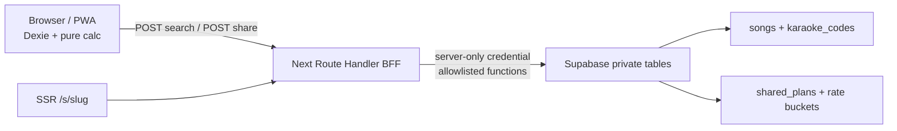

# 싱송 최종 설계 정본 v3.2 — Product, UX, Architecture, Safety

> **상태**: MVP v3.2 확정 정본(Canonical)  
> **작성**: 2026-07-21 · Codex 독립 감사 및 제품/아키텍처/시각 에이전트 합의안  
> **목적**: 기존 문서의 충돌을 해소하고, 구현 에이전트가 추측 없이 만들 수 있는 단일 계약을 제공한다.  
> **우선순위**: 이 문서 → `prompts/ONESHOT_MASTER.md` v3.2 → 도메인별 기존 정본 → 나머지 레거시 문서.  
> **중요**: 기존 문서와 충돌하면 이 문서가 이긴다. 기존 문서는 삭제하지 않고 결정의 근거와 이력으로 보존한다.

---

## 0. 한 장 요약

싱송의 MVP는 애창곡 관리 앱이나 공개 플레이리스트 플랫폼이 아니다.

> **2~4인 노래방 모임의 주최자가 가입 없이 2분 안에 부를 곡과 예상 시간·비용을 정리하고, 친구가 바로 이해하는 티켓 형태로 보내는 로컬 우선 세션 플래너다.**

핵심 산출물은 `플랜`이며, 핵심 전환은 `검색 → 담기 → 신뢰 가능한 예상 → 티켓 → 안전한 링크 공유`다. 공유받은 사람은 설치 없이 보고, 필요하면 외부 브라우저 또는 설치 앱으로 명시적으로 가져온다.

### 구현 전 반드시 닫아야 하는 네 가지

1. **곡 데이터 권리와 품질**: 합법적인 프로덕션 카탈로그가 없으면 `buildCapability=LOCAL_DEMO_READY`, `productionGate=BLOCKED`다.
2. **공유 보안 경계**: anon 직접 테이블 접근, 전체 공유 열거, 무제한 insert를 허용하지 않는다.
3. **저장소 섬**: Kakao WebView, Safari, 설치 PWA의 IndexedDB가 이어진다고 가정하지 않는다.
4. **계산 정확성**: 순방향 최저가와 역계산은 같은 비용함수를 사용하고, 표시용 반올림을 과금 계산에 쓰지 않는다.

### 최종 범위 결정

| 유지(P0)                | 단순화/변경                                  | 후순위(P1+)                  | 제거                                    |
| ----------------------- | -------------------------------------------- | ---------------------------- | --------------------------------------- |
| 단일 활성 플랜          | 3개 요금 탭 → `곡 요금`/`시간 요금` 2개 방식 | 멀티 플랜·히스토리           | iTunes 앨범아트·duration                |
| 카탈로그 검색           | 검색 실패 시 로컬 `직접 추가`                | 키·메모·태그                 | 공개 색인/Discover                      |
| 시간·비용 범위          | 정확한 단일 시간 → `약 범위`                 | 스트리밍 플리 import         | 기기 UUID·fork_count                    |
| 코드 기반 티켓·PNG      | Kakao SDK → OS 공유/링크 복사 우선           | Kakao SDK 고유 기능          | 실시간 공동 편집                        |
| unlisted 링크·가져오기  | 인앱 저장 → 외부 브라우저 handoff            | 계정·동기화                  | TanStack Query 기본 도입                |
| PWA shell·로컬 오프라인 | 설치 보존 약속 제거                          | 설치/브라우저 간 복구 고도화 | 외부 앨범아트·AI 장식·원격 이미지 fetch |

사용자 요청으로 브라우저에서 만드는 deterministic Ticket PNG와 서버의 deterministic OG `ImageResponse`는 허용된 핵심 산출물이다. 둘 다 외부 이미지 없이 같은 `TicketArtworkModel`과 로컬 폰트·도형만 사용한다.

---

## 1. 제품 계약

### 1.1 초기 사용자와 상황

- **주 사용자**: 2~4인 모임에서 장소·시간·예산을 먼저 정리하는 한 명의 주최자.
- **수신 사용자**: 카카오톡/메신저에서 링크를 받아 설치 없이 계획을 확인하는 친구.
- **주요 상황**: 약속 전날~입장 직전, 모바일, 한 손 사용, 네트워크가 불안정할 수 있음.
- **대체재**: 카톡 메시지, 메모 앱, TJ/KY 검색 화면, 머릿속 계산.

혼코노용 장기 애창곡 관리와 공개 콘텐츠 발견은 서로 다른 JTBD이므로 MVP에서 제외한다.

### 1.2 JTBD

> 노래방 약속이 잡혔거나 제안하고 싶을 때, 부를 곡과 실제 시간·비용을 빠르게 맞추고 친구가 바로 이해할 수 있는 형태로 보내고 싶다. 그래야 현장에서 다시 검색하거나 단톡방에서 흩어진 목록과 어림짐작을 다시 정리하지 않아도 된다.

### 1.3 가치 가설

- 목록 자체보다 **시간·비용의 불확실성을 줄이는 것**이 차별점이다.
- 공유 티켓은 장식이 아니라 모임의 실행을 촉진하는 요약물이어야 한다.
- 수신자가 편집에 참여해야 가치가 생기는지, 읽기 전용+명시적 공유 스냅샷 가져오기로 충분한지는 아직 실험 대상이다.

### 1.4 성공 정의

초기 베타의 성공은 주간 앱 리텐션 하나로 판단하지 않는다. 노래방 방문은 이벤트성 행동이다.

- 신규 사용자가 도움 없이 **2분 이내** 첫 곡 3개 이상과 계산 결과에 도달한다.
- 활성화된 플랜 중 티켓 생성 비율과 실제 공유 실행 비율을 구분해 측정한다.
- 5초 노출 뒤 공유받은 사람 10명 중 8명 이상이 곡 수·시간 범위·예상 금액을 정확히 말할 수 있다.
- 실제 노래방 방문 최소 10회에서 예상과 실제의 오차를 기록한다.
- 4~6주 안의 다음 모임에서 다시 사용했는지를 인터뷰/코호트로 확인한다.

정량 임계값과 표본은 `UNKNOWN_REGISTER.md`에서 실험 전에 동결한다. 식별자가 없는데 사용자 전환·고유 도달·k-factor라고 부르지 않는다.

---

## 2. P0 기능 범위와 생명주기

### 2.1 단일 활성 플랜

P0에는 한 기기·한 브라우저 저장소당 **활성 플랜 하나**만 있다.

```ts
type ActivePlan = {
  id: string;
  revision: number; // item/settings mutation 성공 때 transaction 안에서 +1
  createdAt: string;
  updatedAt: string;
};
```

- 첫 실행: 빈 활성 플랜을 만든다.
- 모든 mutation은 UI가 본 `expectedRevision`을 repository에 넘긴다. Dexie transaction 안에서 현재 revision과 비교해 다르면 전체를 rollback하고 `다른 탭에서 플랜이 바뀌었어`와 reload action을 보인다. 맞으면 item/settings 변경과 revision `+1`을 원자적으로 commit한다.
- `BroadcastChannel` 또는 Dexie live query는 다른 탭의 commit을 알려주는 보조 신호일 뿐 정합성 근거는 revision compare다. 자동 last-write-wins나 조용한 merge는 없다.
- `새 플랜 시작`: 현재 플랜이 비어 있지 않으면 확인 대화상자를 거쳐 교체한다.
- 히스토리/자동 보관은 없다. 교체 전 PNG 또는 링크 공유를 제안할 수 있으나 강제하지 않는다.
- 공유 가져오기(레거시 문서의 `fork`):
  - 활성 플랜이 비어 있으면 그대로 가져온다.
  - 비어 있지 않으면 `현재 플랜 바꾸기`와 `취소`만 제공한다. 자동 merge하지 않는다.
  - 같은 slug를 이미 현재 플랜으로 가져왔으면 중복 생성하지 않고 `이미 가져온 플랜` 상태를 보인다.
- 검색의 담기 대상은 언제나 활성 플랜이다. `targetListId`라는 숨은 상태가 없다.
- 티켓 frozen snapshot은 `{planId, revision}`에 묶고 Dexie `ticketSnapshots`에 canonical payload·`artworkSeed`·fingerprint를 영속한다. 같은 revision의 첫 생성만 CAS로 이기며 reload·재공유·다른 탭은 정확히 같은 snapshot을 재수화한다. 편집/다른 탭 commit으로 revision이 바뀌면 이전 snapshot의 OS share action을 비활성화하고 새 snapshot을 준비한다. revoke/expiry는 managed link만 rollover하며 같은 revision의 artwork를 임의 재추첨하지 않는다.

멀티 플랜·이름변경·삭제·히스토리는 P1에서 별도 생명주기와 동기화 전략을 결정한 뒤 추가한다.

### 2.2 플랜 항목

각 항목은 다음 두 출처 중 하나다.

```ts
type PlanItem = {
  id: string; // client UUID
  source: "catalog" | "manual";
  catalogSongId: string | null;
  title: string;
  artist: string;
  karaokeCodes: Array<{ vendor: "TJ" | "KY"; code: string }>;
  order: number;
};
```

불변식:

- `order`는 항상 `0..N-1`의 연속 정수다.
- 추가·삭제·재정렬은 Dexie transaction으로 처리한다.
- 동일 카탈로그 곡은 한 플랜에 한 번만 담는다. 검색에서 재탭은 삭제가 아니라 `담김` 상태다.
- manual 항목은 같은 제목/가수라도 별개로 만들 수 있으나, 생성 시 중복 후보를 알려준다.
- P0 최대 곡 수는 100곡이다. 초과 시 추가 동작을 막고 이유와 해결 행동을 보여준다.
- 재정렬은 P0에서 위/아래 버튼을 정식 접근성 경로로 사용한다. 터치 drag는 필수가 아니다.
- P0에는 신뢰 가능한 duration source가 없으므로 `durationSec`를 로컬/공유 스키마에 넣지 않는다. P1 모델이 권리·정확성 검증 후 schema version을 올려 추가한다.

### 2.3 상태기계

```text
no-plan → create-empty → editing
editing ↔ searching ↔ calculating ↔ ticket-preview
ticket-preview → local-png
ticket-preview → validating-share → creating-share → share-ready
share-ready → share-invoked → share-sheet-resolved | cancelled | retryable-error

view-share → valid | expired | revoked | malformed
valid → import-check → replace-confirm? → local-save → saved
storage-isolated → copy-link → external-browser/install-app → paste-import → local-save
```

`share-sheet-resolved`는 OS sheet Promise가 resolve됐다는 관측 상태일 뿐 실제 메시지 전송 성공이 아니다. `cancelled`는 실패가 아니며 Web Share의 `AbortError`에서 파일을 자동 다운로드하지 않는다.

---

## 3. 정보 구조와 화면 계약

### 3.1 라우트

> **⚠ 갱신 (D-027/D-028/D-029, 사용자 canonical 승인, 2026-07-23)**: 하단 내비를 4탭
> (플랜·보관함·발견·설정)으로 재구성하고 검색을 플랜 흐름 안 bottom sheet로 흡수했다.
> 아래 표와 "2개 탭"·`/search`·"`/discover` 금지" 서술은 이 결정으로 대체된다. 상세는
> `CONFLICT_REGISTER` C-30~C-34, `MOBILE_APP_SHELL_PLAN.md`. 검색 계약(§3.3)과 발권 full-nav
> CSP 경계는 그대로 보존한다.

| 라우트      | 목적                                                     | 데이터                      | 내비게이션                               |
| ----------- | -------------------------------------------------------- | --------------------------- | ---------------------------------------- |
| `/`         | 활성 플랜 편집·라이브 요약·발권 진입·검색 시트           | Dexie + BFF search          | 4탭 중 플랜; 검색은 플랜 내 bottom sheet |
| `/library`  | 발권 기록·공유 링크·가져온 플랜 (기존 P0 영속물 읽기 뷰) | Dexie                       | 4탭 중 보관함                            |
| `/discover` | 정직한 "준비 중" 게시판 (실데이터·색인 0, D-028)         | static                      | 4탭 중 발견                              |
| `/settings` | 로컬 프로필·설치·데이터·정보                             | Dexie(profile)              | 4탭 중 설정                              |
| `/ticket`   | 현재/보관(`?r=`) 티켓 미리보기·PNG·링크 공유             | Dexie + share API           | TabBar 없음                              |
| `/s/[slug]` | unlisted 공유 스냅샷 SSR 열람                            | 서버                        | 앱 TabBar 없음                           |
| `/import`   | 공유 URL/slug를 붙여넣어 현재 저장소로 가져오기          | server exact lookup + Dexie | 설치 PWA/외부 브라우저용 복구 경로       |
| `/offline`  | 앱 shell 복구 안내                                       | static                      | 로컬 플랜으로 이동                       |

P0에는 `/list/[id]`, `/history`, `/auth`를 만들지 않는다. (`/discover`는 D-028로 실데이터
없는 placeholder만 허용 — 실제 카탈로그 색인·큐레이션은 §5.1 정책과 함께 별도 설계.)

### 3.2 홈 `/`

- 상단: 작은 워드마크와 overflow. overflow 안에 `새 플랜 시작`, 저장소 상태 도움말, `내 공유 관리`를 둔다.
- 본문: 하나의 연속 `Session Strip`.
  - 곡 큐 ledger.
  - 계산 경계에 한 번만 쓰는 절취선.
  - `N곡 · 약 A~B분 · 총 C~D원 · 1인 약 E~F원` compact summary.
- 긴 목록에서도 요약과 `N곡 티켓 만들기`가 사라지지 않도록 모바일 `ActionDock`, 데스크톱 sticky summary를 쓴다.
- `canIssueTicket = items.length>=1 && validPricingInput && Number.isSafeInteger(people) && people>=1 && people<=30`이다. false이면 `/ticket` 이동·PNG·snapshot 생성을 모두 막고, ActionDock은 비활성 버튼만 두지 않고 `요금과 인원 입력하기`로 계산 disclosure를 열어 첫 invalid field에 focus한다. 숫자 preset으로 gate를 몰래 통과시키지 않는다.
- 계산 세부 입력은 인라인 카드 더미가 아니라 disclosure/drawer에 둔다.
- 0곡일 때는 계산 숫자 0 카드를 채우지 않는다. 빈 strip과 `곡 담기` 한 가지 행동을 보여준다.

### 3.3 검색 `/search`

- 입력 아래에 결과 수·로딩·오프라인·오류 상태를 한 줄로 알린다.
- 결과는 카드가 아닌 연속 행이며 제목, 가수, TJ/KY 번호, 담기 상태가 핵심이다.
- 검색 결과의 앨범아트는 사용하지 않는다.
- `+ 담기` → `✓ 담김`; 재탭 삭제 없음. 직전 담기는 Toast `실행 취소`로 되돌릴 수 있다.
- 하단 Plan Rail은 현재 곡 수·시간 범위·예상 비용과 `플랜 보기`를 유지한다.
- 결과가 없으면 로컬 전용 `직접 추가`를 제공한다.

IME 계약:

1. composition 중 입력값은 화면에 보인다.
2. composition 중 네트워크 검색은 시작하지 않는다.
3. `compositionend`에서 200ms debounce를 새로 시작한다.
4. composition 중 Enter/Android keyCode 229는 제출로 처리하지 않는다.
5. request sequence와 AbortController를 함께 써서 최신 응답만 commit한다.

### 3.4 티켓 `/ticket`

- TicketCard는 `<article>`과 `<dl>`을 사용하는 의미 콘텐츠다. 전체를 `role="img"`로 만들지 않는다.
- TicketCard/PNG/OG는 곡수·시간 범위·총액·1인당·계산 가정의 **요약 artifact**다. 100곡 전체를 작은 티켓에 밀어 넣지 않는다. 전체 곡 ledger는 `/s/[slug]` HTML에 있고, private PNG만으로 전체 목록을 전달한다고 주장하지 않는다.
- 바코드·타공·시리얼 장식은 `aria-hidden`이다. 링크가 발행된 이미지에는 선택적으로 실제 QR을 넣을 수 있다.
- `이미지 저장`은 기기 안에 남는 private artifact다.
- `링크 만들기`와 OS 공유는 30일간 unlisted 서버 스냅샷을 만드는 public artifact다. P0 OS Share payload는 frozen snapshot URL이며 private PNG 파일이 아니다.
- 서버 업로드 전에 공개 범위, 만료, 포함 정보, 폐기 가능성을 고지한다.
- direct navigation이나 stale tab에서 `canIssueTicket=false`면 티켓을 추정값으로 만들지 않고 플랜의 첫 invalid 입력으로 돌아갈 수 있는 inline recovery를 보인다.
- 다크 모드에서도 export는 canonical light paper theme다.
- PNG는 1080×1350(4:5), OG는 1200×630이다.

### 3.5 공유 `/s/[slug]`

- SSR로 티켓, 곡 목록, 계산 전제를 보여준다.
- `robots: noindex, nofollow, noarchive`; sitemap에서 제외한다.
- HTML/OG response에 `X-Robots-Tag: noindex, nofollow, noarchive`와 `Referrer-Policy: no-referrer`를 함께 둔다. robots 지시는 접근 제어가 아니며 링크 전달자는 여전히 열람할 수 있다는 카피를 유지한다.
- 만료/철회/미존재는 같은 generic unavailable 화면을 사용해 상태 열거를 줄인다.
- 손상된 payload는 조용히 drop하고 fork하지 않는다. 안전하게 보여줄 수 있는 항목만 표시하고 `일부 정보를 확인할 수 없어 가져올 수 없어`를 명시한다.
- 인앱 브라우저에서는 로컬 저장 완료를 약속하지 않는다. `외부 브라우저에서 저장`을 주 행동으로, `링크 복사`를 확실한 폴백으로 둔다.
- 데스크톱 900px 이상은 왼쪽 sticky ticket, 오른쪽 곡 목록·가져오기 2열이다.

---

## 4. 계산 정본

### 4.1 원칙

- 내부 단위는 **정수 초**와 **정수 원**이다.
- 입력이 유효하지 않으면 결과를 만들지 않는다. 음수, `NaN`, `Infinity`, 0분 블록, 0곡 묶음은 거부한다.
- 표시용 반올림과 요금 경계 계산을 분리한다.
- 추정값에는 항상 `약`과 범위를 붙인다.
- 역계산은 목록을 자동 삭제하지 않고 `예산 안에서는 상위 N곡 정도`라는 비파괴적 제안만 한다.

### 4.2 시간 범위

```ts
type DurationEstimate = {
  modelVersion: "fallback-v1";
  lowSec: number;
  midpointSec: number;
  highSec: number;
  coverageBps: 0;
};
```

P0 기본값:

- P0 모델 버전은 `fallback-v1`이며 모든 곡에 165초 / 210초 / 255초를 적용한다.
- 곡 사이 전환: 간격마다 15초 / 25초 / 35초.
- `gaps=max(0,N-1)`일 때 `lowSec=165*N+15*gaps`, `midpointSec=210*N+25*gaps`, `highSec=255*N+35*gaps`다. N=0이면 모두 0이고 UI는 결과 카드 대신 빈 상태를 보인다.
- UI 범위는 바깥쪽으로 5분 단위 반올림한다. 내부 seconds는 보존한다.
- `coverageBps=0`이며 `평균 곡 길이 기준` 설명을 결과 바로 옆에 둔다.
- 실제 duration을 도입하는 모델은 P1의 새 `modelVersion`으로만 추가한다. fallback과 조용히 섞지 않는다.

이 계수는 영구 진리가 아니다. 실제 방문 10회 이상에서 오차를 측정한 뒤 버전과 함께 갱신한다.

### 4.3 곡 요금 최저가

입력:

```ts
type SongPricing = {
  singlePriceWon: number; // safe integer, 1..10_000_000
  bundle?: { songs: number; priceWon: number }; // songs 1..100, price safe integer 1..10_000_000
};
```

묶음을 사서 일부를 쓰지 않는 경우까지 허용할 때:

```text
coinCost(N) = min(
  k*bundlePrice + max(0, N-k*bundleSongs)*singlePrice
) for integer k = 0..ceil(N/bundleSongs)
```

묶음이 단품보다 비싸도 최소값이 단품을 선택한다. `coinCost(0)=0`이고 곡 수에 대해 단조 비감소해야 한다.

### 4.4 시간 요금

```ts
type TimePricing = {
  blockSeconds: number; // safe integer, 60..86_400
  blockPriceWon: number; // safe integer, 1..10_000_000
};

blocks(seconds) = ceil(seconds / blockSeconds);
cost(seconds) = blocks(seconds) * blockPriceWon;
```

- `lowSec`와 `highSec` 각각을 **표시 반올림 전** 입력해 비용 범위를 구한다.
- 코인부스/룸은 별도 계산 알고리즘이 아니라 시간 요금의 맥락 label이다. release 첫 사용에는 보장되지 않은 숫자 preset을 채우지 않고 사용자가 매장 요금을 확인해 입력하게 한다. 이후에는 로컬 `최근 입력`만 재사용한다.
- 서비스 시간은 업소마다 의미가 달라 P0 입력에서 제거한다.

### 4.5 인원 분할

- 인원 범위는 1~30.
- release 첫 사용에는 인원을 추정해 넣지 않는다. 총액은 먼저 보여줄 수 있지만 1인당 값은 사용자가 인원을 입력한 뒤에만 계산하며, 이후에는 같은 저장소의 최근 입력만 명시적으로 재사용한다.
- 1인 예상 상한은 `ceil(total / people)`이며 `원 단위 올림`을 도움말에 명시한다.
- 비용 범위가 있으면 1인 비용도 범위로 표시한다.

### 4.6 역계산

역계산은 **현재 플랜 prefix를 비파괴적으로 추천**한다. `CAP = currentItems.length`, 예산 `B`는 safe integer `0..100_000_000`이다. 곡 요금의 답은 다음 불변식을 만족하는 최대 `N`이다.

```text
coinCost(N) <= B
N == CAP or coinCost(N + 1) > B
```

평균 단가 나눗셈을 사용하지 않는다. 현재 prefix 최대 100곡 범위에서는 명료한 선형 탐색이나 검증된 이진탐색을 쓴다.

시간 요금 예산은 `blocks=floor(B/blockPriceWon)`, `availableSec=blocks*blockSeconds`로 계산한다. `guaranteedN`은 `highSec(prefix N)<=availableSec`인 최대 prefix, `possibleN`은 `lowSec(prefix N)<=availableSec`인 최대 prefix다. 항상 `0<=guaranteedN<=possibleN<=CAP`이다.

### 4.7 필수 테스트

- 0곡, 1곡, 최대 100곡.
- 묶음 경계 전/정확히/후, 묶음이 단품보다 비싼 경우, 남는 묶음을 사는 편이 싼 경우.
- `budget = coinCost(n)-1`, `coinCost(n)`, `coinCost(n)+1`.
- brute-force oracle와 비용 단조성, reverse 최대성 property test.
- fallback-v1 raw seconds와 표시용 5분 반올림 분리.
- 블록 경계 1초 전/정확히/1초 후.
- 1명/30명, 나누어떨어짐/나머지.
- 0·음수·소수 원·NaN·Infinity·unsafe integer·상한 초과·곱셈 overflow 거부.

---

## 5. 검색과 카탈로그

### 5.1 출시 게이트

테스트 fixture는 프로덕션 카탈로그가 아니다. 다음이 없으면 외부 베타를 차단한다.

- 데이터 출처와 이용 가능 근거.
- 수집/관찰 일자, 삭제 요청 연락처, takedown 절차.
- TJ/KY 번호 표본 정확도와 검색 골든셋 결과.
- fixture와 production seed를 구분하는 manifest/checksum.

### 5.2 권장 서버 모델

```text
catalog_sources
  id, name, source_type, source_url, rights_note, observed_at, active

songs
  id, title, artist, title_norm, artist_norm, chosung_title, chosung_artist

karaoke_codes
  id, song_id, vendor, code, variant, source_id, observed_at, active, confidence

song_aliases
  id, song_id, alias, alias_norm, kind
```

한 행에 TJ/KY 하나씩을 억지로 병합하지 않는다. live/remix/재등록/복수 번호와 provenance를 표현한다.

### 5.3 검색 계약

- seed와 query는 같은 `normalizeSearch()`를 사용한다.
- Unicode NFC, trim, 다중 공백 축약, 허용된 구두점 정규화.
- 공백 토큰 AND, 각 토큰은 제목/가수/alias/초성 중 하나에 매치.
- 제목·가수 순서 무관. `아이유 밤편지`와 `밤편지 아이유`가 같은 후보를 찾는다.
- 번호 exact → 제목 prefix → 모든 토큰 exact/prefix → trigram 순으로 랭킹하고 id로 안정 정렬한다.
- 일반 텍스트 최소 2자, 최대 60자; 번호는 1~6자리 exact/prefix 별도 규칙.
- 결과 최대 20, statement timeout, request cancellation.
- 10만곡 규모에서 1~2자/초성 query를 `EXPLAIN ANALYZE`로 검증한다.
- 타깃 사용자 기반 200곡 골든셋에서 존재 곡 top-3 검색 성공률 95% 이상, 번호 표본 정확도 99% 이상을 잠정 출시 기준으로 둔다.

### 5.4 검색 BFF 보호

- browser는 URL/query string에 검색어를 넣지 않고 `POST /api/search`의 작은 JSON body만 사용한다. `Content-Type: application/json`, decoded body 1KiB 상한, same-origin Fetch Metadata를 검사하며 Supabase URL/key/RPC를 알지 못한다.
- BFF는 length/shape를 재검증하고 request timeout/cancellation과 완화된 IP/session rate bucket 또는 WAF를 둔다.
- 1~2자/초성/prefix 순회, page cursor 조합, 높은 동시성으로 전체 카탈로그를 추출하는 abuse case를 threat model과 부하 test에 넣는다. 응답은 최대 20개이며 bulk/export route는 없다.
- query 원문은 URL·application log·analytics·error context에 남기지 않고 응답은 `private, no-store`다. DB/hosting의 statement·request logging에도 원문이 남지 않도록 parameter logging/redaction 설정을 SECURITY ADR과 운영 점검표에 넣는다. catalog 권리 계약이 API 재배포를 제한하면 해당 rate와 반환 필드를 더 좁힌다.

---

## 6. 공유·프라이버시·어뷰징

### 6.1 공개 모델

공유 링크는 **unlisted capability link**다. 비밀번호 인증은 아니며 링크를 전달받은 누구나 만료 전 볼 수 있다. 검색 가능한 게시물이 아니다.

- 기본 수명: 생성 후 30일.
- 생성 기기에는 관리 토큰을 저장하고 티켓 화면과 홈 overflow의 `내 공유 관리`에서 `공유 폐기`를 제공한다. 플랜을 교체해도 만료 전 관리 항목은 로컬에 남는다.
- raw 관리 토큰은 별도 Dexie table에 local-only로 두고 UI·export·analytics·share payload·log에 표시하지 않는다. revoke/expiry 뒤 즉시 local token을 지우고 만료 항목을 정리한다. CSP/XSS gate가 이 capability 보호의 일부다.
- 관리 토큰을 잃으면 셀프 철회가 불가능할 수 있음을 고지한다. 운영자 takedown은 별도로 유지한다.
- Discover를 추가할 때만 별도 명시 동의·검수·index 정책을 설계한다.

### 6.2 최소 공유 payload

```ts
type SharedPlanV1 = {
  schemaVersion: 1;
  artworkSeed: string; // 128-bit random base64url; 내부 plan ID/revision 아님
  items: Array<{
    source: "catalog" | "manual";
    title: string;
    artist: string;
    karaokeCodes: Array<{ vendor: "TJ" | "KY"; code: string }>;
    order: number;
  }>;
  calculation: {
    modelVersion: "fallback-v1";
    songCount: number;
    duration: {
      lowSec: number;
      midpointSec: number;
      highSec: number;
      coverageBps: 0;
    };
    pricing:
      | {
          kind: "song";
          singlePriceWon: number;
          bundle?: { songs: number; priceWon: number };
        }
      | {
          kind: "time";
          blockSeconds: number;
          blockPriceWon: number;
        };
    people: number;
    derived: {
      totalLowWon: number;
      totalHighWon: number;
      perPersonLowWon: number;
      perPersonHighWon: number;
    };
  };
};
```

P0 티켓 제목은 locale microcopy의 고정 문자열이며 payload에 자유 제목을 두지 않는다. `artworkSeed`는 ticket snapshot을 만들 때 Web Crypto로 생성하고, DOM·PNG·SSR·OG가 같은 seed를 쓴다. plan ID/revision은 공개하지 않는다.

제외:

- memo, myKey, tags, history.
- device UUID, analytics identifier, author identity.
- 원본 Dexie ID와 내부 서버 메타데이터.
- 앨범아트 URL과 외부 추적 리소스.

`SHARE_LIMITS`를 client/BFF/DB가 공유한다.

- items 1..100, canonical serialized UTF-8 ≤98,304 bytes(96KiB). 100개 항목 각각 title/artist가 80개의 4-byte code point이고 양 vendor code가 있는 최악 golden vector도 이 상한 안에서 통과해야 한다.
- title 1..80 Unicode code points, artist 0..80 code points.
- title/artist는 NFC·trim·단일 행이며 C0/C1 control, NUL, bidi override/isolate control을 거부한다. 길이는 UTF-16 `.length`가 아니라 정규화 뒤 Unicode code point로 세고, 전체 byte limit은 `TextEncoder`와 서버 UTF-8 결과를 대조한다.
- karaoke code는 1..6 ASCII digits, item당 vendor별 최대 1개, 동일 item/vendor/code 중복 금지.
- `artworkSeed`는 정확히 128-bit random의 canonical 22-char base64url(no padding)이고 Zod object는 unknown key를 거부하는 strict schema다.
- money input 1..10,000,000원, budget 0..100,000,000원, people 1..30, block 60..86,400초.
- 모든 수는 `Number.isSafeInteger`; order는 정확히 `0..N-1`; `songCount===items.length`; low≤mid≤high; low total≤high total.

BFF는 client의 `derived`를 신뢰하지 않고 동일한 versioned pure calc module로 duration·cost·per-person을 재계산한다. 일치하지 않으면 400이다. 자유 텍스트는 text node로만 렌더하며 `dangerouslySetInnerHTML`을 금지한다.

fingerprint는 임의 object insertion order에 기대지 않는다. shared TypeScript module이 schema 순서대로 undefined 없는 `SharedPlanV1` plain object를 재구성해 UTF-8 `JSON.stringify`한 bytes를 canonical form으로 정의하고 SHA-256 fingerprint를 만든다. client/BFF golden vectors로 byte/hash 동일성을 증명한다. pending record에는 이 frozen payload·artworkSeed·fingerprint·idempotency key를 함께 저장한다.

### 6.3 API 경계



불변식:

1. 브라우저는 검색과 공유 모두 BFF를 통과한다. client bundle에 Supabase anon/service credential을 넣지 않는다.
2. `anon`/`authenticated`/`PUBLIC`의 모든 catalog/share/rate table·view·sequence 직접 CRUD/USAGE와 모든 내부 함수 EXECUTE는 0개다. Supabase 새 secret API key가 매핑하는 PostgreSQL `service_role`도 private table/view/sequence 직접 권한은 0이고 allowlisted function만 실행한다.
3. migration은 `ALTER DEFAULT PRIVILEGES`와 개별 `REVOKE`로 함수의 기본 `PUBLIC EXECUTE`도 회수한다. `app_private_owner` 같은 NOLOGIN owner가 definer function/table을 소유하고, exact signature의 allowlisted 함수와 필요한 schema USAGE만 server role에 재부여한다.
4. `SECURITY DEFINER` 함수는 빈 `search_path`, 완전 수식 테이블명, 고정 `statement_timeout`을 사용한다. ACL matrix와 직접 RPC 우회 거부를 contract test한다.
5. P0 server credential은 `server-only` 모듈 한 곳에 격리한 Supabase `sb_secret_*` API key다. 새 key 생성은 legacy key를 자동 revoke하지 않으므로 환경·배포 제거만으로 PASS하지 않는다. migration 뒤 Dashboard/Management API의 legacy `anon/service_role` disabled 증거와 raw key를 기록하지 않는 secure old-key 401/unauthorized probe를 release evidence로 남긴다. DB 권한은 위의 function-only ACL로 축소하고 generic client를 export하지 않으며 `search/create/get/revoke/cleanup` repository 함수만 노출한다. client import, direct table call, bundle secret scan은 build fail이다. 전용 DB role로 더 축소할지는 P1 hardening ADR이다.
6. raw slug는 random 저장값이 아니라 결정적으로 복구한다. `message = concat(UTF8("singsong/share-slug/v1"), byte(0x00), UTF8(canonicalIdempotencyKey))`, `slug = base64url(first16(HMAC-SHA-256(SLUG_DERIVATION_KEY_vN, message)))`로 정확히 22자를 만든다. DB의 private `share_reservations`는 `slug_hash`, `slug_key_version`, `idempotency_hash`, active/terminal state만 보존하고 active share row가 canonical snapshot fingerprint/payload를 가진다. 같은 active idempotency retry는 저장된 key version과 보존된 secret으로 raw slug를 다시 파생하므로 DB commit 뒤 HTTP 응답 유실도 복구된다.
   - key version은 재사용하지 않는다. retiring version의 secret은 그 version으로 만든 마지막 row의 30일 수명+7일 tombstone+7일 retry grace보다 긴 최소 45일간 보존한다. 활성 row가 요구하는 모든 version이 secret store에 있는지 startup/readiness gate로 검사한다. rotation·compromise 절차는 SECURITY ADR에 둔다.
   - `slug_hash`와 `idempotency_hash`는 reservation table에서 unique다. revoke transaction은 reservation을 **즉시** terminal로 바꾸고 active FK를 detach하며 payload/token을 지운다. expiry는 GET/create lookup 모두 DB `now()`로 먼저 판정하고 같은 transaction에서 terminalize/detach한 뒤 generic unavailable/409를 반환한다. daily cleanup은 늦은 정리일 뿐 terminal 전이의 선행조건이 아니다. payload·token·fingerprint·active row를 정리해도 두 high-entropy hash와 terminal state는 제품 namespace 수명 동안 재사용하지 않는다. 따라서 cleanup 전후 모두 오래된 POST replay가 폐기된 URL을 부활시키지 못한다. 이 최소 anti-replay reservation의 용량·보존 근거는 privacy/operations ADR로 검토한다.
   - 다른 idempotency row와의 HMAC collision은 random fallback 없이 generic 409이며 client가 새 share idempotency key로 명시 재시도한다. terminal reservation의 같은 key replay도 Turnstile/quota 전에 generic 409이며 새 key만 허용한다.
7. client는 Web Crypto로 256비트 revoke token과 128비트 `Idempotency-Key`를 만든다. 서버에는 두 hash만 저장하며 management token을 URL/query에 넣지 않는다.
   - BFF가 raw slug/token을 hash한 뒤 DB function에는 hash만 전달한다. raw capability가 SQL parameter/log에 닿지 않게 하고, hash는 고엔트로피 capability의 lookup key로만 쓴다.
8. share POST는 reservation의 idempotency hash unique constraint와 active share의 canonical snapshot fingerprint를 가진다. bounded syntax/body 검사 뒤 reservation+active row를 Turnstile·quota보다 먼저 조회한다. active인 같은 key+같은 snapshot retry는 저장된 version으로 같은 slug를 복구하고 rate quota·Turnstile을 다시 소비하지 않는다. 같은 key+다른 snapshot과 terminal reservation은 generic 409로 거부한다.
9. `fork_count`를 저장하지 않는다.

### 6.4 BFF 보호

- production 및 인터넷 공개 preview/staging의 share 생성은 Turnstile을 요구한다. bypass는 `NODE_ENV=test` 또는 loopback-only local development에서만 server-side로 허용하며 `NEXT_PUBLIC_*`로 제어하지 않는다. 공식 testing key도 test/loopback profile에서만 허용하고 production key 검사에서는 거부한다. 공개 staging이 Turnstile을 쓰지 않으면 deployment auth/IP allowlist로 닫는다.
- share POST는 `application/json`만 받고 platform/body reader에서 decoded raw body를 128KiB(131,072 bytes)로 먼저 제한한 뒤 payload canonical UTF-8 96KiB(98,304 bytes)를 검사한다. `Content-Length`가 없거나 거짓이어도 bounded reader/WAF 한도가 작동하며 unsupported content encoding을 거부한다.
- 서버는 raw IP를 저장하지 않는다. secret HMAC으로 hour/day bucket을 만들어 private rate table에 48시간 이내 보관한다.
- 잠정 상한: 10회/시간, 30회/일/IP bucket. 초과는 `429`와 재시도 시간을 반환한다.
- mutation은 신뢰할 수 있는 배포 origin/Fetch Metadata를 검사하고 JSON content type을 강제한다. proxy IP header는 hosting platform이 보증하는 값만 사용한다. revoke는 decoded body 8KiB, 고정 timeout, create보다 완화된 별도 잠정 bucket(60회/시간·200회/일/IP HMAC bucket)을 두고 missing slug·wrong token·expired/revoked를 동일 404 envelope로 처리한다.
- exact read에도 완화된 abuse/WAF 상한을 두되 메신저 preview bot과 정상 수신 burst를 막지 않도록 별도 bucket으로 실측한다.
- 미완료 create만 Turnstile Siteverify를 server-to-server로 호출한다. client는 token과 동일한 share `Idempotency-Key`만 재전송하고 attempt UUID를 정하지 않는다. BFF는 token 문자열 ≤2,048자를 검사한 뒤 메모리에서 `tokenHash=SHA-256(token)`을 만들고, `digest=SHA-256(concat(UTF8("singsong/turnstile-attempt/v1"), byte(0x00), idempotencyHash, byte(0x00), tokenHash))`의 첫 16 bytes에 RFC 4122 version-4/variant bit를 설정해 Siteverify `idempotency_key` UUID를 결정적으로 만든다. UUID는 authorization secret이 아니라 collision-resistant request binding이므로 별도 회전 key가 없다. 같은 share key+token은 process restart/deploy 뒤에도 같은 UUID이고, 같은 token을 다른 share key에 붙이면 다른 UUID가 되어 cached success를 공유하지 못한다. token/hash/UUID/response는 저장·log하지 않는다.
- bounded timeout Siteverify에서 `success`, exact action `create_share`, 배포별 exact hostname allowlist, `challenge_ts`가 현재보다 30초 넘게 미래가 아니며 300초 이내인지 모두 확인한다. 검증 실패·timeout·limiter 오류는 공개 환경에서 fail closed다. Siteverify 성공 뒤 hour/day quota 판정과 idempotent share insert는 locked upsert/단일 DB transaction이다. 장애 경계는 `검증 전`, `Siteverify 응답 유실/성공 뒤 DB 전`, `DB commit 뒤 HTTP 응답 전`으로 나눠 시험한다. commit 전 token이 만료되면 같은 share key에 새 token을 쓰고 서버가 새 bound UUID를 파생하며, commit 후 retry는 Siteverify/quota 없이 복구한다. 초과는 `429 Retry-After`다.
- payload 96KiB 이하, 최대 100곡, `SHARE_LIMITS`와 cross-field invariant를 강제하고 server calc로 재검산한다.
- application structured log에는 payload·raw slug/token/IP를 명시적으로 기록하지 않는다. 그러나 slug는 URL path이므로 hosting/CDN access log와 browser history에 남을 수 있다. `/s/*`와 OG는 제품 analytics를 전혀 넣지 않고 `/import`는 자동 pageview/session capture를 끈다. slug 없는 typed `import_saved`만 local transaction 후 허용한다. 세 route는 `Referrer-Policy: no-referrer`를 사용하며 플랫폼 path redaction·retention·접근권한을 SECURITY ADR에 기록한다.
- GET은 exact slug만 허용하고 목록 endpoint를 만들지 않는다.
- HTML/exact GET/OG는 `Cache-Control: no-store`와 동적 lookup으로 매 요청 expiry/revoked를 확인한다. HTML과 exact JSON은 각각의 endpoint 안에서 missing/expired/revoked에 동일한 generic 404 status·body shape·headers를 반환하고 내부 telemetry만 이유를 구분한다. OG image route는 valid에 actual image, 세 unavailable 상태 모두에 같은 generic image를 200으로 반환해 crawler의 깨진 이미지 대신 안전한 fallback을 주며 상태별 차이는 내지 않는다. 서비스워커와 Next/CDN cache를 쓰지 않는다.
- `/s/[slug]`, `generateMetadata`, OG route, exact BFF lookup은 Next 16에서 명시적으로 dynamic/no-store가 되게 구성하고 production build 뒤 응답 `Age`/cache headers와 revoke 직후 재요청으로 검증한다. framework flag 하나를 증거로 간주하지 않는다.
- Supabase `pg_cron` daily UTC job이 bounded/idempotent cleanup을 실행한다. rate bucket은 48시간 뒤 삭제한다. revoke transaction과 expiry를 처음 관측한 GET/create transaction은 reservation terminalize+active FK detach+payload/token hash null을 즉시 수행한다. daily job도 아직 관측되지 않은 expiry를 같은 방식으로 terminalize하며, active share tombstone은 terminal 전이 7일 뒤 삭제한다. `share_reservations`는 payload/fingerprint/foreign key 없이 terminal hash reservation으로 남겨 URL·idempotency 재사용을 막는다. scheduler 활성화와 reservation growth/capacity alert는 별도 external evidence다.
- revoke 직후 origin HTML/OG는 즉시 generic unavailable을 반환해야 한다. 이미 저장된 Kakao·검색엔진·CDN preview cache의 제거 시간은 통제할 수 없으므로 별도 runbook과 사용자 고지로 다루고 즉시 삭제를 약속하지 않는다.

### 6.5 저장소 handoff

웹 컨텍스트 간 IndexedDB 연속성을 가정하지 않는다.

- Kakao/Instagram 등 in-app UA에서는 `이 브라우저에 저장`을 주 행동으로 두지 않는다.
- 외부 브라우저 열기가 보장되지 않으면 링크 복사와 단계 안내를 제공한다.
- 설치 PWA의 `/import`는 임의 URL을 server fetch하지 않는다. client가 canonical origin의 정확한 `/s/<22-char-base64url>` 또는 raw 22-char slug만 parse해 정규화된 slug를 BFF exact lookup에 보낸다. protocol/host/port/redirect를 서버 입력으로 넘기지 않는다.
- 저장이 끝난 컨텍스트의 이름을 명시한다: `Safari에 저장했어`, `설치한 싱송에 저장했어`.
- 설치 프롬프트는 이관이 자동이라고 말하지 않는다. `설치하면 기존 데이터가 더 안전하게 따라가` 같은 카피를 금지한다.
- 저장소 probe는 `idbAvailable`, `persisted=true|false|unknown`, `inAppHint`, `standalone` 신호를 분리한다. `ephemeral`이라고 확정하거나 보존을 보장하지 않는다.
- 실제 iOS/Android/Kakao 기기 매트릭스를 통과하지 못하면 handoff test는 `BLOCKED + EXTERNAL_AUTHORITY`다.

### 6.6 P0 공유 행동 순서

1. 포함 필드·링크 소유자 공개성·30일 만료·철회를 preflight에서 확인한다.
2. preflight 확인 뒤 현재 revision의 immutable snapshot을 idempotently create/reuse한다. 이 네트워크 단계가 끝나기 전에는 OS share button을 활성화하지 않는다.
   - 동일 `{planId, revision, canonicalFingerprint}`의 만료 전 managed share가 있으면 그 URL을 재사용한다.
   - 첫 POST 전에 idempotency key를 local pending record에 저장하고 network retry/reload에도 같은 key를 쓴다. 성공 시 slug/expiry를 같은 record에 확정한다.
   - revoke/expiry 또는 revision 변경 뒤에만 새 key/link를 만든다. P0에는 수신자별 여러 링크 발행 UI가 없다.
3. URL이 준비되면 별도 명시적 `공유 시트 열기` button을 보여준다. 그 click handler는 어떤 `await`도 앞에 두지 않고 user activation 안에서 즉시 `navigator.share({title,text,url})`를 호출한다. snapshot 준비 뒤 plan revision이 바뀌면 stale URL을 쓰지 않고 다시 준비한다.
4. Promise resolve는 OS sheet가 반환된 사실일 뿐 실제 수신 성공이 아니다. `AbortError`는 아무 fallback도 강제하지 않는 취소다.
5. 미지원/기술 오류에는 같은 URL의 링크 복사를 제안한다. private PNG 저장은 별도 보조 행동이며 조용히 서버 snapshot을 만들지 않는다.

---

## 7. 기술 아키텍처

### 7.1 기준 스택

| 영역                  | 결정                                                                                    |
| --------------------- | --------------------------------------------------------------------------------------- |
| Runtime               | Node.js 24 LTS 최신 패치, `.nvmrc`/engines 고정                                         |
| Framework             | Next.js 16.1.x App Router, React 19.2 계열, TypeScript strict                           |
| Styling               | Tailwind CSS 4.x + semantic CSS variables                                               |
| Accessible primitives | `@base-ui/react` 하나만 사용                                                            |
| Motion                | `motion`, import `motion/react`                                                         |
| Class composition     | `clsx` + `tailwind-merge`의 `cn()`                                                      |
| Local DB              | Dexie + `dexie-react-hooks`; React 바깥 repository/transaction이 정본                   |
| Server DB             | Supabase Postgres                                                                       |
| Server boundary       | `server-only`; credential과 privileged repository의 client import를 build에서 차단      |
| Validation            | Zod discriminated unions + shared constants                                             |
| Image export          | html-to-image, font ready 확인 후 canonical light 캡처                                  |
| PWA                   | Serwist Turbopack spike 통과 후 고정; 자동 `skipWaiting` 금지                           |
| Test                  | Vitest + property/oracle tests, Playwright + `@axe-core/playwright`                     |
| Package               | Corepack으로 pnpm 버전 고정, lockfile·`TOOLCHAIN_LOCK.md` 동결, `latest` 부동 설치 금지 |

TanStack Query는 P0 기본 의존성이 아니다. 서버 검색에 실제 캐시·재검증 이점이 증명될 때만 추가한다. Zustand는 컴포넌트 간 휘발 draft가 복잡해질 때만 사용하고, Dexie 데이터의 복제 정본으로 만들지 않는다.

빌드는 암묵적 기본값 없이 `APP_PROFILE=fixture|release`를 요구한다.

| 명령                               | 계약                                                                                                                                                 |
| ---------------------------------- | ---------------------------------------------------------------------------------------------------------------------------------------------------- |
| `build:demo` / `verify:demo`       | 결정적 합성 fixture만 허용하고 모든 화면에 `TEST DATA` watermark를 둔다. production 공유 생성은 꺼져 있다.                                           |
| `build:release` / `verify:release` | catalog rights manifest/checksum, production 설정, 실제 security gate를 요구한다. fixture·test bypass·loopback 예외가 bundle/seed에 있으면 실패한다. |

첫 의존성 해석에서만 승인된 exact version으로 lockfile을 만들고, 그 다음부터는 frozen install만 허용한다. `TOOLCHAIN_LOCK.md`에는 Node/pnpm/package exact version, 외부 binary와 OS 요구사항, lifecycle script, 설치 이유, 검증 명령을 기록한다. 패키지·lockfile·install script는 실행 전 감사한다.

### 7.2 상태 소유권

| 상태                                     | 정본                                                                                                                                                        |
| ---------------------------------------- | ----------------------------------------------------------------------------------------------------------------------------------------------------------- |
| active plan/items/settings/imported slug | Dexie transaction                                                                                                                                           |
| 검색 input/composition/request seq       | local React state/hook                                                                                                                                      |
| 계산 결과                                | 저장하지 않는 pure derived value                                                                                                                            |
| 계산 사용자 입력                         | Dexie plan settings                                                                                                                                         |
| ticket frozen snapshot                   | Dexie `ticketSnapshots`, unique `{planId,revision}` + CAS; canonical payload·artworkSeed·fingerprint와 `issueMotionClaimedAt`을 reload/다른 탭에서도 재사용 |
| pending/managed share                    | Dexie local-only record가 snapshot FK·idempotency key·slug/expiry 상태·별도 revoke token을 소유; server 성공 시 immutable row와 대조                        |
| share lifecycle/expiry/revoke            | server DB                                                                                                                                                   |
| sheet/dialog/toast                       | primitive-local state                                                                                                                                       |
| theme                                    | OS default; 사용자 토글을 제공할 때만 local setting                                                                                                         |

### 7.3 PWA 정책

- 앱 shell과 정적 에셋, 한 번 방문한 로컬 홈 진입만 오프라인 보장한다.
- 공유 페이지, 공유 API, 검색 API, mutation은 precache/runtime cache하지 않는다.
- SW 버전, activation, unregister kill switch를 둔다.
- 새 SW는 waiting 상태로 두고 사용자 `업데이트` 승인 후 적용한다. draft 중 자동 reload 금지.
- `sw.js`는 `no-cache`.
- Lighthouse PWA badge를 설치 가능성 증거로 사용하지 않는다.
- manifest/아이콘/controlled page/offline shell/Android 설치/iOS 홈 화면/standalone 실행을 각각 증명한다.
- 사용자에게 설치를 적극 제안하는 것은 저장소 handoff 실기기 스파이크 이후다.
- Serwist+Turbopack spike 실패는 `FAIL` + `TECHNICAL`이다. 그 상태에서도 비-PWA 로컬 웹 core는 `LOCAL_WEB_CORE_READY`까지 진행할 수 있지만, PWA를 에이전트가 임의로 `DEFERRED` 처리하거나 즉석 handwritten service worker로 바꾸지 않는다. 범위 변경은 사람이 정본을 갱신해 `DEFERRED_APPROVED`로 승인해야 한다.
- PWA가 `REQUIRED`인 현재 정본에서 `LOCAL_DEMO_READY`와 `verify:release`는 manifest·controlled page·offline shell·waiting update 검증이 없으면 실패한다. 사람이 증거와 함께 정본을 바꾼 `DEFERRED_APPROVED`만 예외이며, 구현 에이전트가 “if enabled”로 해석하지 않는다.

### 7.4 CSP와 외부 스크립트

- Phase 0에 Report-Only로 Next hydration, Motion inline style, OG, SW 동작을 실측한다.
- `object-src 'none'`, `base-uri 'self'`, `frame-ancestors 'none'`을 기본으로 한다.
- `X-Content-Type-Options: nosniff`, `Permissions-Policy: camera=(), microphone=(), geolocation=(), payment=(), usb=(), web-share=(self)`, 기본 `strict-origin-when-cross-origin`을 함께 적용한다. `/s/*`, OG, `/import`는 `Referrer-Policy: no-referrer`다.
- nonce/SRI/제한적 style attribute 허용 중 하나를 ADR로 선택하고 이유·성능 영향을 기록한다.
- production script에는 `unsafe-eval`을 허용하지 않고 broad `unsafe-inline`을 넣지 않는다. Turnstile의 script/frame/connect source는 해당 route에만 공식 origin을 최소 허용하며 report body는 URL/token을 redaction하고 rate-limit한다.
- Kakao JS SDK는 P0 필수가 아니다. OS Web Share → 링크 복사 → 이미지 저장 순으로 제공한다.
- SDK를 나중에 넣으면 공식 도메인·버전·무결성·동의·CSP를 검증하고 사용자 액션 뒤 lazy-load한다.

### 7.5 오류와 관측성

- 제품 analytics와 운영 telemetry를 분리한다.
- 사용자 오류에는 correlation ID를 주되 서버 원문·SQL·토큰을 노출하지 않는다.
- 최소 운영 지표: search/share/SSR/OG 성공률과 p95, 4xx/5xx/429, DB row/byte 증가, 만료 정리 실패, SW 버전 분포.
- synthetic probe: 검색 fixture, 유효 공유 SSR, expired/revoked 404, OG generic fallback.
- quota 50/75/90% 경고와 incident/runbook을 외부 베타 전 준비한다.

---

## 8. 시각·모션·접근성

세부 정본은 [`design/VISUAL_MOTION_DIRECTION.md`](./design/VISUAL_MOTION_DIRECTION.md)다.

### 8.1 대표 방향: Session Strip

곡을 담는 동안 하나의 티켓 원지가 채워지고, 계산 영역에 시간·금액이 인쇄되며, 발권 시 공유 티켓이 된다. 티켓을 마지막 화면에만 붙이는 장식으로 쓰지 않는다.

- canvas는 따뜻한 off-white, strip은 paper white, ink는 deep aubergine.
- rose는 행동, ochre/gold는 금액, ink는 정보.
- 곡은 카드가 아니라 ledger row. shadow는 strip과 최종 ticket만.
- primary button은 pill이 아닌 12px radius 직사각형.
- 마이크·음표·헤드폰·네온·glass·3D coin·floating blob을 브랜드 언어로 쓰지 않는다.
- 절취선은 계산→발권 경계에 한 번만 쓴다.

### 8.2 구현 원칙

- Dialog/AlertDialog/Drawer/Popover/Slider는 Base UI primitive를 감싼다. 수제 focus trap 금지.
- SongRow 전체 클릭과 내부 버튼을 중첩하지 않는다.
- Slider는 보조 수단이며 숫자 입력 대안을 항상 둔다.
- ActionDock과 TabBar가 동시에 화면을 과도하게 가리지 않도록 하나의 하단 slot 계약을 쓴다.
- control border는 인접 surface 대비 3:1 이상, 텍스트는 WCAG 2.2 AA를 만족한다.
- `--gold`는 장식 전용, 금액 텍스트는 `--money-text`/교정된 `--gold-text`.
- 320px, 200% text resize, 400% browser zoom/reflow, 긴 한글, 100곡, 큰 금액, forced-colors를 검증한다.

### 8.3 모션

- 상호작용 80~180ms, sheet open 260ms/close 180ms, ticket issue 360ms를 상한 가이드로 쓴다.
- transform/opacity 위주. width/height/top/left/filter/box-shadow를 프레임마다 애니메이션하지 않는다.
- 발권은 고정된 slot 뒤/아래에서 TicketCard만 y 24→0px, opacity 0→1, rotation -0.6→0deg로 상승한다. slot·TicketCard 크기·타공 geometry는 morph하지 않으며 `issueMotionClaimedAt` CAS 승자만 revision당 한 번 재생한다.
- slider drag/typing 중 숫자 count-up 금지.
- 티켓 라우트에서 page transition과 발권 모션을 동시에 재생하지 않는다.
- `MotionConfig reducedMotion="user"`; reduced motion에서는 의미를 보존한 즉시 상태+짧은 fade.
- screen reader announce는 프레임마다가 아니라 300ms settle 후 한 번만 한다.

### 8.4 생성 이미지의 역할

`design/assets`의 생성 이미지는 디자인 사고와 리뷰를 위한 **reference-only**다. 프로덕션 UI, 로고, 아이콘, 빈 상태 원화로 그대로 출하하지 않는다. 실제 앱은 semantic HTML, CSS, 직접 검수한 SVG로 재구성한다.

---

## 9. 분석과 제품 검증

### 9.1 이벤트 의미

이름보다 의미와 발화 지점을 고정한다.

| 의미                 | 발화                                                                                                             |
| -------------------- | ---------------------------------------------------------------------------------------------------------------- |
| plan_activated       | 신규 세션에서 3곡 이상 + 유효 계산 결과 최초 도달                                                                |
| ticket_rendered      | TicketCard와 export model이 성공적으로 생성                                                                      |
| snapshot_created     | 서버 공유 row 생성 성공, 재공유에는 발화하지 않음                                                                |
| share_invoked        | 지원 여부·user activation을 확인한 뒤 `navigator.share({title,text,url})`를 호출한 순간. 전달 성공을 뜻하지 않음 |
| share_sheet_resolved | `navigator.share()` Promise가 resolve. OS가 실제 전송했는지는 알 수 없음                                         |
| link_copy_succeeded  | Clipboard adapter가 frozen snapshot URL 복사를 완료                                                              |
| image_save_succeeded | private ticket PNG의 로컬 저장 adapter가 성공을 반환. 링크 공유와 별개                                           |
| import_saved         | 정확한 slug snapshot이 Dexie transaction에 저장 완료                                                             |

`calc_changed`는 초기 blank나 저장된 최근 입력을 복원할 때 발화하지 않는다. `song_added`는 `catalog|manual` source를 가진다. `AbortError`는 조용한 취소이며 성공/실패로 세지 않는다. OS share payload는 항상 서버 preflight를 통과한 frozen snapshot URL이다. PNG 저장은 별도 보조 행동이고 P0 공유의 주 payload가 아니다.

P0는 `/s/*`를 계측하지 않으므로 실제 수신자 수·고유 열람자·전송 성공률을 주장하지 않는다. 메신저 preview bot과 사람을 안정적으로 분리할 근거가 생기기 전에는 snapshot 생성/공유 sheet 호출/로컬 공유 가져오기(`import_saved`) 같은 관측 가능한 사건만 측정한다.

### 9.2 개인정보 최소화

- 영구 device ID 금지.
- analytics provider에 slug, 제목, 가수, memo, 검색 원문을 보내지 않는다.
- session 단위 식별이 꼭 필요하면 24시간 이내 폐기되는 랜덤 flow ID만 사용하고 정책에 공개한다.
- 고유 사용자 리텐션을 측정할 수 없으면 세션 재방문/이벤트 비율로 정확히 명명한다.

### 9.3 도구 결정

Vercel Hobby의 custom events를 있다고 가정하지 않는다. 구현은 typed `AnalyticsPort`와 테스트 sink를 제공하되 provider/예산이 결정되지 않으면 production adapter는 no-op이다. 해당 정량 검증은 `testResult=NOT_RUN`, `evidenceLevel=NONE`, `blockerKind=PRODUCT_DECISION`로 기록한다. 이것이 release 필수 증거로 지정된 경우에만 `productionGate=BLOCKED`의 blocker가 된다. 제품 가설은 초기에는 관찰 테스트와 실제 방문 회고로도 검증한다.

---

## 10. 품질·보안·출시 게이트

### 10.1 상태 어휘

테스트 결과, 증거 종류, 차단 원인, 범위 처분을 한 enum에 섞지 않는다.

```ts
type TestResult = "PASS" | "FAIL" | "BLOCKED" | "NOT_RUN";
type EvidenceLevel = "AUTOMATED" | "MANUAL" | "STATIC_ONLY" | "MOCK_ONLY" | "NONE";
type BlockerKind = "EXTERNAL_AUTHORITY" | "ENVIRONMENT" | "TECHNICAL" | "PRODUCT_DECISION" | null;
type FeatureDisposition = "REQUIRED" | "DEFERRED_APPROVED" | "OUT_OF_SCOPE";
```

mock, 정적 검토, 로컬 endpoint 200을 실제 Postgres RLS, Kakao OG, iOS 설치 동작의 PASS로 승격하지 않는다. `PASS + STATIC_ONLY`는 문서/정적 요구만 통과했다는 뜻이며 실제 통합 PASS를 대신하지 않는다.

재개 시 source fingerprint만 맞는다고 이전 PASS를 신뢰하지 않는다. 각 Stage boundary/pause의 immutable checkpoint는 normalized state, persistent 문서 snapshot hash, evidence index, environment subject/digest, volatile evidence의 관측시각·만료·재검증 정책, 이전 checkpoint hash를 묶는다. RUN_STATE의 `latestCheckpointHash`와 `lastGreenCheckpointHash`는 normalized snapshot에서 둘 다 omit/null해 자기참조를 끊고, checkpoint를 durable atomic rename한 뒤 두 pointer를 한 번의 atomic RUN_STATE replace로 갱신한다. runtime/toolchain은 매 resume, 외부 ACL/key/domain/Turnstile/scheduler/OG는 매 resume와 staging/production admission 직전에 재검증하며 stale/changed evidence는 `NOT_RUN`으로 하향한다.

readiness도 현재 구현 능력과 출시 게이트를 분리한다.

```ts
type BuildCapability =
  | "NOT_READY"
  | "LOCAL_WEB_CORE_READY"
  | "LOCAL_DEMO_READY"
  | "STAGING_READY"
  | "PRODUCTION_CANDIDATE";
type ProductionGate = "BLOCKED" | "READY_FOR_HUMAN_RELEASE";
type ProductionBlocker = {
  code: string;
  evidence: string[];
  owner: string;
  unlockCondition: string;
};
```

상태 정의와 전이는 다음과 같다.

| 상태                   | 필요한 실제 증거                                                                                                                                                                                                                                           | 아직 없어도 되는 것                                                    |
| ---------------------- | ---------------------------------------------------------------------------------------------------------------------------------------------------------------------------------------------------------------------------------------------------------- | ---------------------------------------------------------------------- |
| `NOT_READY`            | Stage 0 STOP gate가 닫히지 않았거나 Stage 1~5 core의 필수 증거가 하나라도 실패/누락                                                                                                                                                                        | 없음. 다음 상태를 주장하지 않는다.                                     |
| `LOCAL_WEB_CORE_READY` | demo profile에서 Stage 0~5의 foundation, 단일 로컬 플랜, fixture 검색, 계산 oracle, 티켓·PNG가 `verify:demo`의 해당 gate를 통과                                                                                                                            | 공개 share와 PWA는 실패/미완료일 수 있으며 production gate는 `BLOCKED` |
| `LOCAL_DEMO_READY`     | fixture/`TEST DATA` profile로 Stage 0~9 전체 P0 journey, local demo share adapter, import, **필수 PWA shell**, a11y/visual을 통과하고 Critical/High 0                                                                                                      | 실제 catalog 권리·외부 key·공개 도메인·실기기 같은 외부 권한           |
| `STAGING_READY`        | `build:release/verify:release`, 권리 manifest, 실제 staging Supabase `sb_secret_*` + legacy key disabled/old-key 401 evidence, Turnstile, HTTPS, cleanup scheduler, BFF/ACL contract, 실제 staging-origin OG가 보호된 staging에서 통과하고 Critical/High 0 | 공개 출시 승인, production 운영/법무 및 필요한 production 실기기 증거  |
| `PRODUCTION_CANDIDATE` | 모든 REQUIRED 자동·수동·실기기·privacy/takedown/backup/monitoring/field gate와 production 조건이 통과하고 blocker 0                                                                                                                                        | 사람의 최종 release/deploy 승인만 남음                                 |

전이는 증거가 누적될 때만 상향한다. 필요한 gate가 회귀하면 그 gate를 만족하는 가장 낮은 상태로 즉시 하향하고 blocker를 남긴다. mock/static evidence로 단계를 건너뛰지 않는다. `productionGate=READY_FOR_HUMAN_RELEASE`는 `PRODUCTION_CANDIDATE`에서만 가능하다. 범위 변경은 사람이 정본을 갱신한 `DEFERRED_APPROVED` 없이는 readiness 의미를 바꾸지 않는다.

에이전트는 `RELEASED`나 “production ready”를 선언하지 않는다. 모든 필수 gate가 통과하면 최대 `PRODUCTION_CANDIDATE + READY_FOR_HUMAN_RELEASE`이고, 실제 공개는 권한 있는 사람이 별도 승인·배포한다.

### 10.2 구현 시작 STOP 게이트

- 이 문서와 원샷 v3가 레거시 문서보다 우선한다는 합의.
- 계산 테스트 oracle과 P0 경계 케이스 확정.
- direct table grant 0 및 공유 API 설계 확정.
- fixture/prod catalog profile 분리.
- 이미지/카탈로그 권리 미해결 시 demo-only 표기.
- 기존 worktree 변경 보존과 도구 preflight.

### 10.3 자동 게이트

- `verify:demo`와 `verify:release`를 분리한다. 둘 다 해당 profile의 frozen lockfile install, lint, typecheck, unit/property, build를 실행하고 release는 fixture/test bypass가 없음을 추가 증명한다. 현재 `REQUIRED` PWA의 controlled page·offline shell·waiting update evidence가 없으면 `verify:release`는 실패한다.
- 실제 local Supabase/PostgREST로 anon table enumeration 거부, function grant snapshot, create/get/revoke/expire/rate-limit contract.
- Chromium/WebKit Playwright 정상·비정상 여정.
- axe critical/serious 0; 정적 검토로 대체 불가.
- PNG signature, 1080×1350 dimensions, font-ready, visual snapshot.
- OG 1200×630, content type, expired/revoked generic fallback.
- viewport 320×568, 390×844, 768×1024, 1440×900; light/dark/200% text/400% zoom/reduced-motion/forced-colors.
- lab 성능은 고정 기기/CPU/network/cache 조건에서 cold·warm 각 N회(최소 5회), LCP/TBT/CLS와 scripted interaction latency의 median·worst를 기록한다. lab 표본을 `p75`라고 부르지 않는다. 홈 initial JS gzip 잠정 목표는 170KiB 이하이며 측정 도구와 route chunk 기준을 같이 남긴다.
- field 성능의 LCP/INP/CLS p75는 동일 release·region·device class에서 충분한 RUM/CrUX 표본이 있을 때만 판정한다. 표본이 없으면 `NOT_RUN + NONE`이며 0이나 PASS로 쓰지 않는다.
- 검색 p95 잠정 800ms는 region, catalog row 수, query corpus(번호/한글/초성/실패), cold/warm, 반복 수와 동시성을 고정한 server-side 분포다. 계산 입력→UI 100ms 이하는 별도 scripted latency다.

### 10.4 실제 기기 게이트

- Android Chrome, iOS Safari, iOS Home Screen.
- Kakao Android/iOS in-app.
- 링크 열람, 외부 브라우저 handoff, paste import, PNG 저장/공유, OS share 취소.
- Safari에서 데이터 생성→설치 PWA 첫 실행 시 데이터가 자동 이전되지 않는 경우의 카피/복구.
- 한국어 iOS/Gboard/Samsung IME.
- 실제 Kakao OG는 공개 HTTPS·도메인·cache 조건에서만 `PASS + MANUAL`.

### 10.5 외부 베타 차단조건

하나라도 남으면 `productionGate=BLOCKED`이고 각 항목을 `ProductionBlocker`로 기록한다.

- 곡 데이터 출처/권리/삭제 절차 없음.
- 공유 rate limit·Turnstile·expiry·revoke 없음.
- 전체 공유/곡 테이블 anon dump 가능.
- 실제 기기 handoff 검증 없음.
- 개인정보처리방침·이용 안내·신고/takedown 경로 없음.
- backup/restore와 quota monitoring 없음.
- 테스트 fixture가 production seed로 배포됨.

---

## 11. 단계별 구현 전략

수평 레이어가 아니라 사용자 가치의 vertical slice로 만든다.

1. **Preflight와 계약 동결**: 도구, git, blocker, requirements trace.
2. **기반**: Next/Node, 토큰, Base UI, MotionConfig, tests, local DB skeleton.
3. **로컬 플랜**: 직접 추가→담기/삭제/순서→Session Strip→새로고침 유지.
4. **검색**: 정규화/RPC/IME/오프라인/직접 추가.
5. **계산**: corrected forward/reverse, 범위, 접근 가능한 입력, property tests.
6. **티켓/PNG**: semantic TicketCard, export, ticket issue motion.
7. **안전한 공유**: BFF, rate limit, exact read, expiry/revoke, noindex.
8. **import/handoff**: idempotent replace, in-app detection, `/import`.
9. **PWA**: cache allowlist, update consent, offline shell, storage messaging.
10. **독립 검증과 핸드오프**: 별도 리뷰, 회귀, external blocker.

공통 컴포넌트 16개를 먼저 만들지 않는다. 각 slice에 필요한 primitive/pattern만 만들고 `/dev/components`에 누적한다. 접근성·모션·오류 상태는 마지막 retrofit 단계가 아니라 해당 slice와 함께 완료한다.

---

## 12. 결정 기록

### 지금 확정

- 초기 사용자는 2~4인 모임 주최자.
- P0는 단일 활성 플랜.
- 공유는 unlisted/noindex, 30일 TTL, 최소 payload, capability revoke.
- album art/iTunes 제거.
- Kakao SDK는 P0 제외, OS share 우선.
- Node 24 + Next 16.1 + Base UI + Motion.
- Session Strip을 대표 시각 문법으로 사용.
- 계산은 integer seconds/won, exact forward/reverse, display range.
- 설치/PWA가 기존 IndexedDB를 자동 이전한다고 말하지 않음.

### 외부 증거 후 갱신

- 프로덕션 카탈로그 source와 vendor-code 병합 정책.
- 시간 추정 계수와 허용 오차.
- PWA 설치 유도 시점과 자동 이관 방식.
- analytics provider/예산과 정량 베타 임계값.
- 읽기전용 공유가 공동선곡 문제를 충분히 해결하는지.
- 30일 TTL이 너무 짧거나 긴지.

세부 unknown과 검증 owner는 [`UNKNOWN_REGISTER.md`](./UNKNOWN_REGISTER.md)에서 관리한다.

---

## 13. 외부 근거

- [Next.js 16 / 16.1](https://nextjs.org/blog/next-16-1), [Next PWA guide](https://nextjs.org/docs/app/guides/progressive-web-apps)
- [Node.js release/EOL table](https://nodejs.org/en/about/previous-releases)
- [Motion React upgrade guide](https://motion.dev/docs/react-upgrade-guide)
- [Base UI quick start](https://base-ui.com/react/overview/quick-start)
- [W3C Web Share Recommendation](https://www.w3.org/TR/web-share/)
- [Serwist Turbopack integration](https://serwist.pages.dev/docs/next/turbo)
- [Supabase RLS](https://supabase.com/docs/guides/database/postgres/row-level-security), [API security](https://supabase.com/docs/guides/api/securing-your-api)
- [Supabase new API keys migration](https://supabase.com/docs/guides/getting-started/migrating-to-new-api-keys), [API keys](https://supabase.com/docs/guides/getting-started/api-keys)
- [Supabase database functions](https://supabase.com/docs/guides/database/functions)
- [Cloudflare Turnstile server-side validation](https://developers.cloudflare.com/turnstile/get-started/server-side-validation/)
- [WebKit Safari 17.2 storage behavior](https://webkit.org/blog/14787/webkit-features-in-safari-17-2/), [WebKit storage policy](https://webkit.org/blog/14403/updates-to-storage-policy/)
- [Apple iTunes Search API terms](https://developer.apple.com/library/archive/documentation/AudioVideo/Conceptual/iTuneSearchAPI/)
- [Vercel Web Analytics limits](https://vercel.com/docs/analytics/limits-and-pricing)
- [Vercel runtime logs](https://vercel.com/docs/logs/runtime)
- [Next.js revalidation and caching](https://nextjs.org/docs/app/getting-started/revalidating)
- [Chrome: Lighthouse PWA audit deprecated](https://developer.chrome.com/docs/lighthouse/pwa/installable-manifest)

---

## 14. 구현 에이전트에게 남기는 마지막 원칙

1. 문장을 충실히 구현하는 것보다 사용자의 돈·데이터·공개범위를 틀리지 않는 것이 우선이다.
2. 보안·법무·외부 비용·공개범위의 미결정은 보수적 추측으로 넘기지 말고 STOP/BLOCKED로 남긴다.
3. 실제로 실행하지 않은 검증은 통과가 아니다.
4. 생성 이미지는 영감이고, 시맨틱 HTML/CSS/SVG가 제품이다.
5. 싱송의 얼굴은 카드 더미나 음악 클리셰가 아니라 **작성 중인 티켓 원지가 약속 티켓으로 발권되는 과정**이다.
