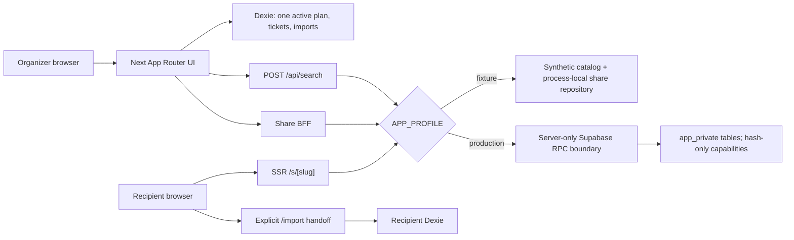

# SingSong Architecture v3

이 문서는 현재 구현을 설명하는 후속 아키텍처 문서다. 기존 `docs/engineering/ARCHITECTURE.md`는 사용자 변경과 역사적 의도를 보존하기 위해 수정하지 않았으며, 충돌 시 `FINAL_BLUEPRINT.md`와 이 문서의 v3 경계를 따른다.

## 시스템 경계

개인 플랜의 진실은 브라우저 IndexedDB이고 서버는 immutable 공유 스냅샷만 소유한다. 브라우저는 Supabase를 직접 import하거나 private table을 조회하지 않는다. 인증, 계정, 클라우드 동기화, 결제, 실시간 협업은 P0 경계 밖이다.

## 라우트와 사용자 흐름

| Route       | 역할                                            | 상태 소유권                             | 캐시/색인                               |
| ----------- | ----------------------------------------------- | --------------------------------------- | --------------------------------------- |
| `/`         | 검색 → 순서 → 계산 → 티켓 발급                  | Dexie active plan                       | PWA shell 허용                          |
| `/search`   | 같은 planner의 검색 집중 진입                   | Dexie + 일시적 request state            | 검색 요청/응답 no-store                 |
| `/ticket`   | frozen ticket, PNG, 링크 생성·공유·철회         | Dexie ticket + local capability receipt | PWA shell 허용; 서버 share는 no-store   |
| `/s/[slug]` | immutable read-only SSR 수신 화면               | exact server lookup                     | no-store, noindex, no-referrer, SW 제외 |
| `/import`   | canonical slug 검증 후 명시적 local replacement | recipient Dexie                         | noindex, no-referrer                    |
| `/offline`  | 연결 실패 복구 설명                             | 정적 shell                              | PWA fallback                            |

핵심 흐름은 `검색/직접 추가 → 위·아래 순서 변경 → 사용자가 가격·인원 입력 → 범위 계산 → revision 고정 티켓 → PNG 또는 unlisted 링크 → 수신자가 교체를 확인하고 import`다. 공유는 공동 편집이 아니며 import는 원본과 독립이다.

## 상태와 데이터

### 로컬 Dexie

- `plans`: 고정 ID `active-plan`, revision CAS, items, nullable people/pricing. 한 번의 mutation transaction이 revision을 1 증가시키고 order를 `0..N-1`로 다시 쓴다.
- `tickets`: unique `[planId+revision]`, canonical payload, 128-bit artwork seed, fingerprint, 발권 모션 claim. 동일 revision의 reload/다른 탭은 같은 snapshot을 읽는다.
- `imports`: exact slug unique, importedAt, 적용된 planRevision. 같은 공유를 중복 import하지 않는다.
- `BroadcastChannel`과 Dexie `liveQuery`는 변경 알림일 뿐 conflict 해결 규칙이 아니다. `expectedRevision` 불일치는 rollback하고 사용자에게 다시 불러올 경로를 준다.
- 공개 receipt는 Dexie v4의 `managedShares`, raw idempotency/revoke capability는 분리된 `managedShareSecrets`에 저장한다. v3 데이터는 transaction으로 원자적으로 이관하고, 두 값을 결합하는 범위는 공유 API 경계로 한정한다. pending·만료 데이터는 함께 정리하며 브라우저 저장소를 삭제하면 셀프 철회 능력을 잃을 수 있다. 공유 payload나 로그에는 raw capability를 포함하지 않는다.

### Immutable shared snapshot

`SharedSnapshotV1`은 strict object이며 `schemaVersion`, canonical `artworkSeed`, 1~100개의 최소 곡 필드, `fallback-v1` 계산 입력과 재계산 가능한 derived 범위만 포함한다. plan/device/user ID, memo, personal key, tag, history, 자유 티켓 제목은 없다. 제목/가수는 NFC·단일행·code-point 상한을 적용하고 C0/C1/NUL/bidi control을 거부한다. canonical serializer가 정해진 key 순서의 UTF-8 JSON을 만들고 SHA-256 fingerprint를 계산한다.

### Production Supabase

`app_private.share_reservations`, `shared_plans`, `share_rate_buckets`는 NOLOGIN owner가 소유하고 RLS와 immutable trigger를 사용한다. raw idempotency key, slug, revoke token, IP는 DB로 보내지 않고 SHA-256/HMAC hash만 전달한다. 30일 TTL, 관측 시 즉시 terminalize, terminal row 7일 후 payload cleanup, rate bucket 최대 48시간 보존을 적용한다. `service_role`은 `app_api` schema usage와 exact RPC 6개만 받고 private table/view/sequence 직접 권한은 0이다.

## 계산 엔진

모든 계산은 safe integer seconds/won이다. `N`곡과 `gaps=max(0,N-1)`에 대해:

- low = `165*N + 15*gaps`
- midpoint = `210*N + 25*gaps`
- high = `255*N + 35*gaps`
- `coverageBps=0`, `modelVersion=fallback-v1`

화면의 5분 단위 바깥 반올림은 표현 함수일 뿐 시간요금 block 계산에는 raw seconds를 쓴다. 곡 묶음 최저가는 가능한 묶음 수 `0..ceil(N/bundleSongs)`를 전수 열거한다. 인당 금액은 마지막에만 올림한다. 예산 역산은 같은 forward 함수로 최대 feasible prefix를 찾고 기존 곡을 삭제하지 않는다.

## 검색

검색어는 URL에 두지 않고 JSON `POST /api/search` body로만 전송한다. decoded body는 1KiB, query 60자, 결과 20개 상한이다. client는 IME composition 동안 요청을 멈추고 composition 종료 뒤 200ms debounce, `AbortController`, monotonically increasing sequence로 stale response를 차단한다. NFC/공백/구두점 normalization과 token AND, exact number/title 우선의 stable ranking은 provider 경계 양쪽에서 공유한다. fixture는 합성 데이터이며 production catalog rights/quality gate를 대신하지 않는다.

## 공유 BFF와 보안

- Mutation은 same-origin/Fetch Metadata, `application/json`, decoded-body 상한을 확인한다.
- create는 canonical 22자 idempotency key와 43자 revoke token을 받고 서버에서 payload를 재계산한다. canonical 96KiB, raw 128KiB 상한이다.
- production slug는 versioned HMAC의 첫 128-bit를 canonical base64url로 만들며 DB에는 hash와 key version만 둔다.
- production 생성은 Turnstile과 HMAC IP hour/day bucket을 요구하고 장애 시 fail closed한다. fixture의 우회는 명시적 local profile에서만 가능하다.
- exact read/list-free API, generic unavailable 404, revoke token의 Authorization header, structured redacted log와 correlation ID를 사용한다.
- nonce CSP, `nosniff`, frame deny, capability/permission deny, `/s`·`/import`의 no-referrer와 noindex를 적용한다.

운영 Supabase ACL, Turnstile action/hostname/time, trusted proxy, scheduler, access-log redaction은 실제 인프라에서 별도 검증해야 하며 로컬 static test로 PASS 처리하지 않는다.

## PWA, 렌더링, 접근성

Serwist는 생성 worker를 사용하되 `skipWaiting:false`로 두고 새 worker를 사용자가 승인할 때만 적용한다. 아이콘/Next static asset은 cache-first, `/`, `/ticket`, `/import`, `/offline` shell은 network-first다. API, 검색, share HTML, OG 및 mutation은 캐시하지 않는다. IndexedDB가 플랜의 진실이며 SW cache가 데이터베이스 역할을 하지 않는다.

UI는 Session Strip/CUTLINE 토큰, 하나의 주 표면, 절취선/ledger 위계, 반응형 grid를 사용한다. semantic article/list/dl/form, skip link, visible `:focus-visible`, aria-live 오류·저장 알림, 키보드 위·아래 reorder, dark mode, forced-colors, reduced-motion을 제공한다. 티켓 발권은 `motion/react`의 transform/opacity만 사용하고 snapshot CAS를 이긴 context에서 한 번만 재생한다. PNG는 외부 이미지 없이 light 1080×1350으로 렌더한다.

## 오류와 관측성

화면은 loading/empty/offline/invalid/conflict/storage unavailable/server error를 별도 상태로 보여 주고 재시도·돌아가기·직접 추가·복사 같은 복구 행동을 제공한다. 서버 로그 allowlist는 route label, status, request ID, duration뿐이며 payload, 검색어, raw slug/token/IP, 곡 콘텐츠를 기록하지 않는다. analytics provider가 정해지지 않으면 production은 no-op이어야 하며 수신자 수, 실제 전송 성공, 사람 기반 retention을 추정하지 않는다.

## 배포와 롤백

fixture와 production build는 `APP_PROFILE`로 fail-closed 분리한다. production은 Supabase secret, active slug key/version, IP HMAC key, Turnstile keys, canonical site URL이 모두 있어야 빌드한다. 배포는 immutable application artifact를 이전 버전으로 되돌릴 수 있어야 하고 DB schema/key namespace는 파괴적으로 rollback하지 않는다. 자세한 순서는 루트 `README.md`와 `HANDOFF.md`를 따른다.
